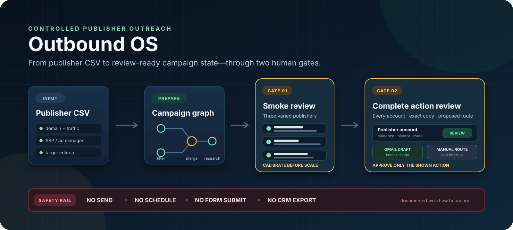
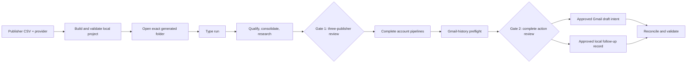
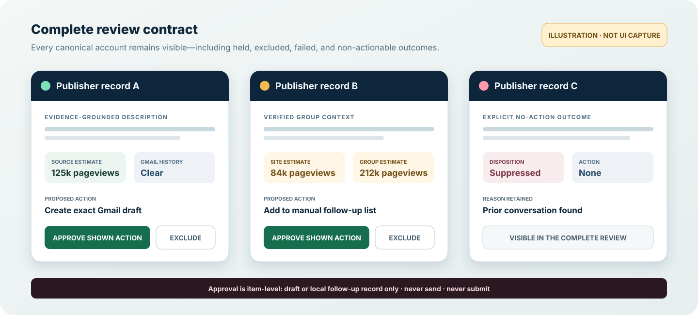

<p align="center">
  
</p>

# Outbound OS

**A controlled publisher-outreach workflow for Codex.** Turn a publisher CSV and a named SSP or ad manager into a validated, resumable campaign workspace designed around two human review gates.

`Codex skill` · `Python 3.10+` · `Local-first campaign state` · `Draft-only action boundary`

> [!IMPORTANT]
> This repository builds and validates the local campaign scaffold. Live public-web research, VisualizeMe reviews, Gmail history checks, and Gmail draft creation depend on external Codex capabilities and are **not** exercised by the bundled offline tests.

[How it works](#how-it-works) · [Verified proof](#verified-proof) · [Quick start](#quick-start) · [Safety boundary](#safety-boundary) · [Architecture](#architecture) · [Limitations](#limitations)

## What it actually ships

Outbound OS is an agent skill plus a provider-configurable project template. Its builder:

- accepts a publisher CSV, a named SSP/ad manager, and optional targeting criteria;
- preserves the source file byte-for-byte and fingerprints the launch inputs;
- creates a unique campaign project transactionally—without overwriting a different run;
- seeds structured campaign state, schemas, agent roles, and a static workflow graph;
- validates the generated project before handing it back to the operator; and
- stops before research, mailbox access, reviews, or external actions begin.

The generated project then carries the documented two-review operating contract into a separate Codex task.

## Verified proof

The strongest claims here come from executable checks in the repository, not from a product mockup.

| Evidence status | What supports it |
| --- | --- |
| **Verified offline — transactional project build** | [`scripts/test_build_project.py`](scripts/test_build_project.py) creates a disposable five-row campaign, checks parameter application and source preservation, resumes an identical fingerprint, and creates a new destination when criteria change. |
| **Verified offline — exactly two planned review gates** | The test and [`campaign-graph.json`](assets/project-template/system/graph/campaign-graph.json) require `smoke_review` followed by `full_review`. |
| **Verified offline — safety and showcase boundaries** | [`validate_system.py`](assets/project-template/system/scripts/validate_system.py) checks graph ordering, no-send/no-submit settings, required safeguards, skills, schemas, and the absence of named Pipeline/CRM/scheduled-follow-up paths. |
| **Implemented invariant — canonical-copy parity** | [`campaign_engine.py`](assets/project-template/.agents/skills/run-ssp-outreach/scripts/campaign_engine.py) validates that draft intents and manual-action outputs preserve the canonical publisher brand, subject, body, and paragraph breaks. The two checks below do not exercise a populated action-output parity case. |

Both bundled offline checks pass against the current tree:

```sh
python3 scripts/test_build_project.py
python3 assets/project-template/system/scripts/validate_system.py \
  --root assets/project-template
```

Expected completion lines:

```text
PASS: fresh Raptive build, parameters, transactional project, two gates, ...
PASS: project structure, graph, safeguards, skills, and scripts are valid
```

These checks prove the builder and static contracts. They do not prove live research quality, connector behavior, or a rendered review experience.

## How it works

Outbound OS separates setup from campaign execution so a build task cannot silently become an outreach task.



### Phase 1 — build and seed

1. Provide one publisher CSV and the SSP/ad-manager name.
2. Keep or override the defaults for monthly traffic, verticals, and geography.
3. Let the skill create a unique folder under `~/Desktop/Codex/SSP Projects/`.
4. The builder preserves the input, seeds campaign state, runs validation, and returns the exact project path.

### Phase 2 — open and run

1. Add the exact generated campaign folder as a local Codex project—not the shared parent folder.
2. Start a new task inside it.
3. Type exactly `run`.
4. The documented workflow proceeds to a three-publisher calibration review, then to a complete item-level review.

The build step does not browse sites, read Gmail, serve a review, create a draft, or send anything.

## The complete-review contract

<p align="center">
  
</p>

*Illustration of the documented review contract—not a screenshot of a running interface.*

The full-review contract is designed to keep every canonical account visible, including excluded, held, failed, suppressed, and non-actionable outcomes. For actionable items, the decision applies only to the exact displayed draft or local route.

The repository contains the review schemas and generation rules. It does not contain a captured VisualizeMe session or a browser-tested implementation of the illustrated controls.

## Inputs and outputs

### Required input

| Input | Contract |
| --- | --- |
| Publisher source | Readable `.csv` containing a URL or domain column |
| Provider | Non-empty SSP or advertising-manager name |

### Optional targeting

- Minimum monthly traffic: `50000` by default; accepts forms such as `50k` and `1.5m`.
- Verticals: `travel,travel_adjacent` by default.
- Geographies: unrestricted by default.
- One-line note and a project label.

> [!NOTE]
> Source metric names vary. The included test fixture uses `Monthly Visitors`, while the documented review contract labels retained source estimates as estimated monthly pageviews. Confirm the source metric before presenting it publicly; the builder does not convert one audience metric into another.

### Generated local project

- the original CSV preserved under the campaign source folder;
- `PROJECT_INPUT.json` and `BUILD_RECEIPT.json`;
- campaign-scoped canonical state and audit records;
- a static graph, schemas, narrow agent roles, and deterministic engine;
- review payload and action-intent locations for the execution phase; and
- a shared suppression-memory file for confirmed cross-campaign facts.

## Quick start

### 1. Install the skill

```sh
mkdir -p "${CODEX_HOME:-$HOME/.codex}/skills"
git clone https://github.com/aitransformationdirector/Outbound-OS.git \
  "${CODEX_HOME:-$HOME/.codex}/skills/ssp-publisher-outreach-showcase"
```

The public product name is **Outbound OS**. The stable invocation identifier remains `$ssp-publisher-outreach-showcase` so existing skill references and generated projects do not break.

### 2. Start the guided build

Attach the publisher CSV and ask:

```text
Use $ssp-publisher-outreach-showcase to prepare an outreach project for
ExampleManager from the attached publisher CSV. Use defaults.
```

The skill explains the two phases, confirms the required launch values, builds the local project, validates it, and returns the exact folder to open.

### 3. Run the generated project

Open the exact returned folder as a local Codex project, start a task inside it, and type:

```text
run
```

This second phase requires the Codex environment and capabilities described below. It was not executed as part of the bundled offline test.

## Requirements and compatibility

| Component | Status | Notes |
| --- | --- | --- |
| Project builder on macOS with Python 3.11 | **Verified** | The disposable builder test and static validator pass. |
| Other Unix-like systems with Python 3.10+ | **Expected but unverified** | The campaign engine uses Unix file locking. |
| Windows | **Requires adaptation** | `fcntl` is not available natively. |
| Codex skill discovery and local projects | **Expected but unverified here** | Required for guided intake, generated-project handoff, and execution. |
| Public-web research and subagents | **Requires environment support** | Evidence quality and site accessibility vary. |
| VisualizeMe review | **Requires environment support** | The repository defines the contract and payloads; no captured review is bundled. |
| Gmail history and draft creation | **Requires connector access and approval** | Draft creation is conditional; sending is never authorized. |

This showcase is preconfigured for a TIKI operator and includes a default sender identity in [`references/input-contract.md`](references/input-contract.md). Change the defaults before using it for another team or identity.

## Safety boundary

Outbound OS is deliberately conservative about external action:

- Approval can authorize an exact Gmail **draft** or a local manual follow-up record.
- Nothing authorizes sending or scheduling email.
- Nothing authorizes submitting a form, posting a message, or calling a publisher.
- Public contact tokens are leads for verification, not approved routes.
- Every expected account must end as completed, excluded, held, or explicitly failed.
- Gmail history is activity evidence, not publisher enrichment.
- The showcase ends before CRM state, opportunity export, production handoff, or scheduled follow-up.

### Data retained locally

- The source CSV is preserved byte-for-byte and its original absolute path is recorded.
- Campaign state may contain publisher contacts, research evidence, review feedback, copy, Gmail thread/draft identifiers, and manual-route details.
- Confirmed opt-outs, prior relationships, and similar facts may be retained in shared cross-campaign suppression memory.
- Research tasks send relevant public and supplied campaign context to Codex and its bounded subagents.

Use non-sensitive fixtures for demonstrations. Review the generated project and connector permissions before using real publisher data.

## Architecture

The static outer graph keeps safety boundaries and completeness checks fixed while allowing read-only research to fan out.

| Design choice | Purpose |
| --- | --- |
| Transactional builder | Leave no half-created project after a failed build. |
| Input fingerprint | Resume an identical build without overwriting a different campaign. |
| Campaign isolation | Keep leads, decisions, copy, approvals, and actions under one campaign ID. |
| Single canonical writer | Let subagents research independently while one primary agent owns state. |
| Two fan-in gates | Calibrate on three publishers, then review every account and exact proposed action. |
| Explicit failure rows | Prevent failed or ambiguous accounts from disappearing silently. |
| Canonical copy record | Keep review text and downstream draft/manual intents aligned. |
| Documented drift-check contract | Require matching drafts to be reconciled immediately before an approved draft action. |

Read the generated-project [`ARCHITECTURE.md`](assets/project-template/ARCHITECTURE.md) for the complete graph rationale, safeguards, and trade-offs.

## Project map

```text
Outbound-OS/
├── SKILL.md                         builder workflow and approval boundaries
├── agents/openai.yaml               Codex display metadata
├── references/                      guided intake and input contract
├── scripts/
│   ├── build_project.py             transactional project builder
│   └── test_build_project.py        disposable offline integration test
└── assets/project-template/
    ├── .agents/skills/run-ssp-outreach/
    ├── .codex/agents/               narrow research and verification roles
    ├── system/graph/                 static campaign graph
    ├── system/schemas/               structured record contracts
    ├── system/scripts/               static project validator
    ├── START_HERE.md                 generated-project handoff
    └── ARCHITECTURE.md               graph design and limitations
```

## Limitations

- The offline test does not run public research, Gmail, VisualizeMe, connector permission flows, or a real Codex campaign task.
- The repository does not bundle a rendered review, manual-queue interface, or browser test for the documented controls.
- Ownership, contact-route, provider, and traffic evidence can be incomplete or stale; the workflow contract requires a safer held/no-action state when evidence is insufficient.
- Human-gate enforcement ultimately depends on the host environment and the integrity of submitted review feedback.
- Shared suppression memory is intentional cross-campaign state and must contain only confirmed facts.
- The static validator checks named prohibited downstream paths; it is not a proof that every possible integration is absent.

## License

No license file is currently included. Public visibility does not grant reuse rights; choose and add a license before inviting redistribution or external contributions.
