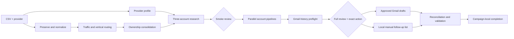

# Codex SSP Outreach architecture

## Outcome

This project turns a publisher CSV plus an SSP/ad-manager name into a researched outreach campaign with two planned human reviews:

1. three varied publishers for calibration;
2. every canonical publisher and the exact proposed Gmail-draft or local manual-route action.

It is a Codex project. It does not depend on Claude workflows.

## Why this is a graph

The old workflow described many stages in sequence. This rebuild makes dependencies explicit:

The static outer graph is intentional. Research inside it can branch and run concurrently, but safety boundaries, completeness barriers, and human gates cannot be improvised away.

## Graph concepts applied

| Graph concept | Implementation |
| --- | --- |
| Bounded nodes | Each research or decision job has one responsibility and a JSON Schema output. |
| Data edges | Dependencies are declared in `system/graph/campaign-graph.json`; ordering is not used where no data dependency exists. |
| Fan-out | Independent candidates and canonical accounts can be researched by read-only Codex subagents in bounded batches. |
| Pipelines | Each account moves through research, conditional verification, disposition, and copy without waiting for unrelated accounts. |
| Fan-in barriers | Used only for account consolidation, review completeness, and action reconciliation. |
| Runtime routing | Traffic, vertical, ownership, provider evidence, route type, Gmail history, and review decision select downstream paths. |
| Verifiers | Material ownership, provider, contact-route, and claim exceptions go to a separate adversarial verifier. |
| Failure isolation | A failed node is retained as `failed` or `held`; it cannot disappear as a filtered null. |
| Convergent cycles | Route research has an attempt limit and deduplicates all checked routes. Feedback rebuilds only affected downstream items. |
| Deterministic edges | Normalization, filtering, IDs, state transitions, copy templates, validation, and reduction run in code. |
| Single-writer merge | Subagents are read-only. The primary Codex agent imports their structured results into canonical state. |

## Deliberate operating choices

- The intake questionnaire is removed. Defaults apply unless the one-line launch instruction overrides them.
- The execution preflight is folded into the complete review, reducing three reviews to two.
- The final decision is item-level. `Approve shown action` authorizes only the exact displayed Gmail draft or local manual queue entry.
- Sending, scheduling, and form submission remain prohibited.
- Provider logic is parameterised; no SSP or ad manager is hard-coded.
- Campaign state is append-auditable and resumable by source hash plus provider.
- Common ownership is resolved before contact research to avoid duplicate publisher outreach.
- Gmail history is checked before the complete review, so the user reviews the real post-suppression action.
- Calendar reminders default to off to avoid another permission or configuration stop.

## Folder model

| Location | Purpose |
| --- | --- |
| `00_INBOX` | Optional place to drop one source CSV. |
| `01_CAMPAIGNS/<campaign_id>` | Immutable source, canonical state, reviews, and action receipts. |
| `02_REVIEW` | Current VisualizeMe review payloads and returned feedback. |
| `03_OUTPUTS` | Campaign-local reports and manual follow-up outputs. |
| `.agents/skills` | Reusable Codex outreach run skill. |
| `.codex/agents` | Narrow read-only subagent roles. |
| `system/graph` | Outreach workflow graph. |
| `system/schemas` | Node, edge, approval, and action contracts. |
| `system/scripts` | Static project validator. |

## Safety and reliability boundaries

- Public web research can be incomplete, blocked, stale, or ambiguous. The system exposes the gap and chooses a safer no-action state.
- Source email tokens are leads for verification, not approved contact routes.
- Parallel research improves elapsed time but still consumes model usage and is limited by Codex concurrency and service capacity.
- Gmail connector permissions may require a platform confirmation; the project cannot bypass that.
- VisualizeMe runs on localhost. The local Codex task must remain available while a review is open.
- The system can create approved Gmail drafts, but it never sends them.
- Manual form/profile/phone routes are queued locally and never submitted automatically.
- A highly unusual publisher or commercial context may still need model-written copy, but it is held to the same evidence and wording validation.

## Validation

`system/scripts/validate_system.py` checks the static graph, its acyclicity, schemas, two-gate invariant, Gmail ordering, safeguards, skills, agents, and script syntax.

`scripts/test_build_project.py` runs the installer in disposable directories. It
verifies source preservation, configuration, stable campaign preparation,
exactly two declared review gates, the no-send contracts, the Pipeline-free
boundary, collision behavior, and deterministic project validation.
